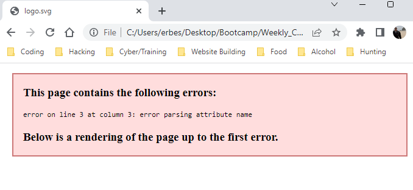

# SVG_Logo_Maker!

## About the Logo Maker
This application will generate a logo for you based on your responses to a couple of questions.

## Issues 
Unfortunately, right now I am having trouble with the application parsing the name so it will not generate an actual logo. Everything else seems to be functioning normally.

## Screenshots
The video is in my Images folder

## Github Repo
This is the link for the github repo where this project sits
https://github.com/erbester51/SVG_Logo_Maker
